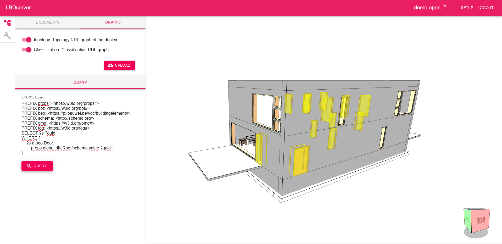

# Getting Started with the LBDserver front end 

## Prerequisites
* Make sure you have [nodejs and npm](https://nodejs.org/en/download/) installed.
* (Optional) Create a dedicated folder for all your LBDserver downloads.

## Installation
* (option 1a: using [git](https://git-scm.com/download)) - run `git clone https://github.com/LBDserver/front-react.git` in your favourite terminal, in your favourite folder.
* (option 1b: using ZIP folders) - Go to the CODE button at the top of the repository and click `Download ZIP`. Extract the folder.
* Once the repository is extracted, run `npm install` to install the necessary modules. This may take a while. 

## Startup
* Run the command `npm start` in a terminal (in the folder where you installed this repository)
* The application will be hosted on port 3000. You may find it at http://localhost:3000.

## Initial project setup
* NOTE: For the current prototype version, you will need to have a CORS-enabler (plugin) installed in your browser.
* Create a new user at '/register' (see navbar). A local user will be registered, with a local profile/webId (TBD).
* You are now authenticated for the current session (don't refresh; at this moment we use an application state, so there are no cookies for a more persistent login (TBD?))
* Go to '/setup' (using the navbar => again: no persistent login yet that would enable use of your browser url bar) and create a new project, which will be loaded immediately.
* You can use the lbdserver "resources" repository to download a sample project (the duplex, of course). If you are authenticated, you can upload documents and graphs to the project. 
* (temporary) if you give a file the label 'gltf', the app will try to visualise it in the viewer upon selection. Not crash-proof yet for files that are labeled gltf but are actually another filetype.
* You can now query the project and visualise your sparql query by (1) selecting the gltf file ("DOCUMENTS"), and then select the named graph ("GRAPHS"). A SPARQL editor will pop up, enabling you to visualise certain elements. The default query gives an indication how a guid is linked to an element. The "?guid" parameter is hardcoded in order to visualise the results.
* By default, unauthenticated agents have read access (you can change this at setup or later). So the guid of your active project can actually be used by other people to read project data. If you store it for later use, or you're comfortable using MongoDB or GraphDB GUIs. 

## End result
If all goes well, you should be able to end up with an interactive 3D environment like the one below:

## Create your own plugin
Information on how to create your own plugin is available on the [wiki](https://github.com/LBDserver/front-react/wiki/Creating-a-Plugin-in-the-GUI)